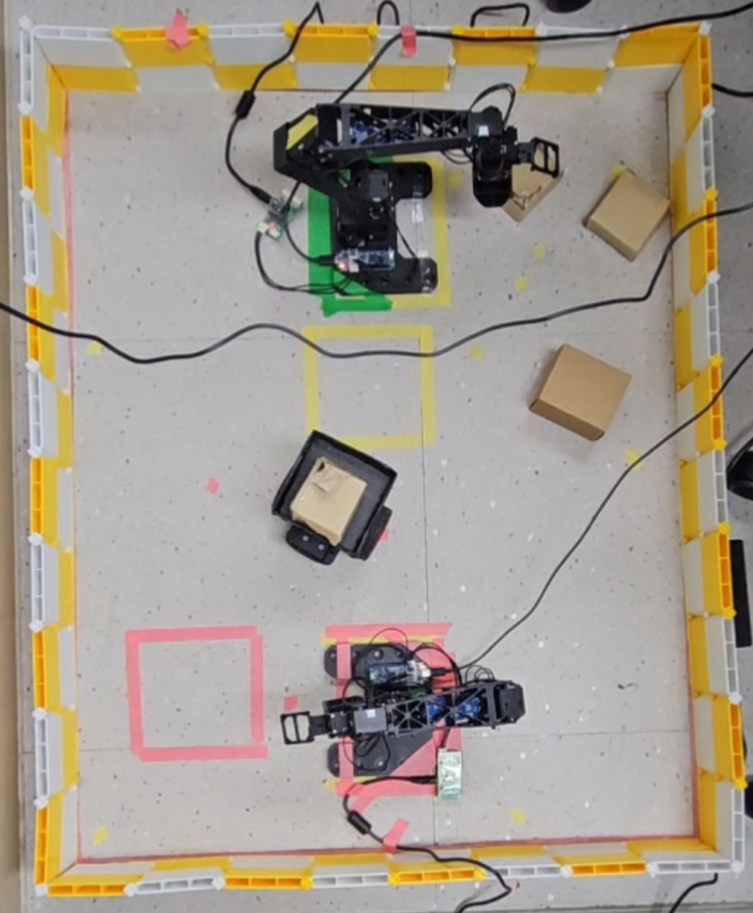
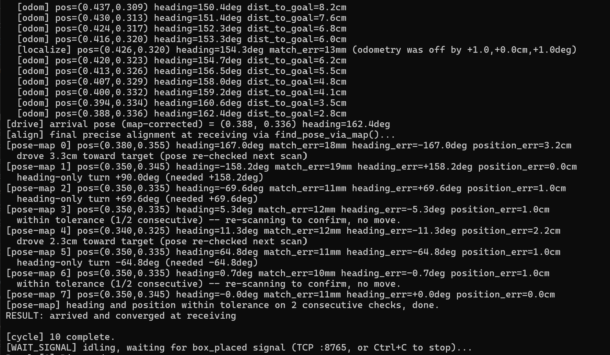
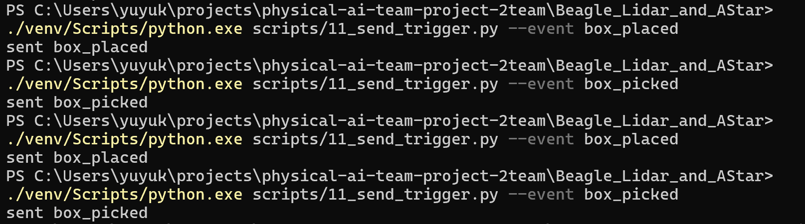
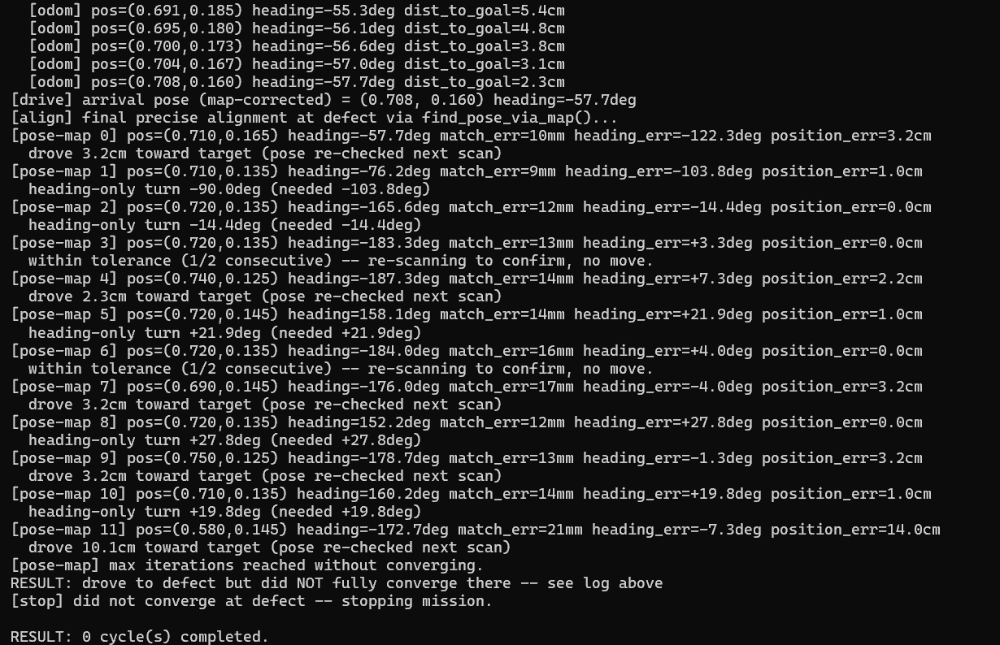

# English Version

# Beagle LiDAR + A* — Receiving/Defect Shuttle

**This is the final version of the Beagle shuttle mission** — the one used
for the actual submission/demo. `Beagle/` and `Beagle_mobile_robot/` are
earlier implementations kept only for development history; they are
superseded by this folder and should not be used.

Beagle robot mission: idle at a **receiving zone**, wait for a `box_placed`
signal from the OMX arm, drive to a **defect zone** using A* + Pure Pursuit,
align precisely against a LiDAR map, wait for a `box_picked` signal once the
OMX arm has picked the box, then drive back and wait for the next signal.

Unlike `Beagle_mobile_robot` (dead-reckoning only), this version continuously
corrects its position against a real LiDAR point-cloud map while driving, and
does a final precision alignment pass (position + heading) at each zone
before considering the leg done. Real-hardware-only, no `--dry-run` mode.

## Layout

Work area: 0.86m x 0.70m.

- Receiving zone: (0.35m, 0.345m), heading 0°
- Defect zone: (0.72m, 0.135m), heading 180°

All of this lives in
[`config/course_config.json`](config/course_config.json), not hardcoded in
the mission script.

## Folder layout

```text
common/      Hardware wrapper, navigation, and precision-alignment logic
             (hw.py, navigate.py, dock.py, mapping.py, scan_align.py, comm.py)
config/      course_config.json — zone positions/headings, boundary size
data/        map_points.json (LiDAR point-cloud map), obstacle_map.json,
             per-zone reference scans -- built once via the setup scripts below
scripts/     Numbered setup/calibration scripts + 10_shuttle_mission.py (the mission itself)
simulator/   Simulated scene, used by early sim-only scripts (untested/unused
             in the current real-hardware workflow)
```

## Install

```powershell
python -m venv venv
.\venv\Scripts\activate
python -m pip install --upgrade pip
python -m pip install -r requirements.txt
```

`roboid` (the real-hardware driver) may need to come from Robomation's
installer rather than PyPI.

The main mission script (`10_shuttle_mission.py`) is real-hardware only --
there is no `--dry-run` mode.

## Run on the real robot

One-time setup (only needed for a new robot/room):

```powershell
python scripts\00_connection_check.py
python scripts\00b_check_drive_direction.py
python scripts\03_calibrate_and_realign.py --zone receiving --calibrate
python scripts\03_calibrate_and_realign.py --zone defect --calibrate
python scripts\05_map_obstacles.py
python scripts\08_build_map.py
```

Then, with the robot physically placed at the receiving zone (position +
heading matching `course_config.json`):

```powershell
python scripts\10_shuttle_mission.py
```

Trigger signals from a second terminal (or from the OMX side) via TCP:

```powershell
python scripts\11_send_trigger.py --event box_placed
python scripts\11_send_trigger.py --event box_picked
```

Useful flags on `10_shuttle_mission.py`: `--cycles N` to stop after N round
trips, `--dynamic-obstacles` to react to obstacles that appear mid-drive
(off by default, re-verify before relying on it), `--align`/`--align-heading`
to fall back to older alignment methods for comparison.

## Results

Physical setup (receiving zone top, defect zone bottom, OMX arm and boxes visible):



10 consecutive round-trip cycles completed without stopping:



OMX-Beagle TCP signal exchange (`box_placed` / `box_picked`):



A known-limitation case: heading search failed to converge within `max_iters`
at the defect zone (see Notes below):



More run logs and setup photos: [`../photos/beagle_shuttle_결과/`](../photos/beagle_shuttle_결과/)

## Notes

- Pose while driving is continuous odometry (encoder + gyro dead-reckoning),
  corrected periodically against the LiDAR map (`drive_with_localization()`
  in `common/navigate.py`) -- this gets the robot close, not exact.
- On arrival, `find_pose_via_map()` (`common/dock.py`) does a separate,
  tighter position+heading alignment pass against the same map before the
  leg is considered done (position error < 2cm, heading error < 6.5° by
  default). If it can't converge within `max_iters` (12), the mission stops
  rather than continuing from an unverified pose.
- Confirmed on real hardware: 10 consecutive round-trip cycles completed
  without stopping.

## Limitations

- Within the tolerance above (position < 2cm, heading < 6.5°) alignment is
  stable, but tightening those thresholds further causes the correction to
  oscillate instead of converging.
- Alignment iteration count varies run to run (commonly 3-9, occasionally
  8-9) and can take longer near ambiguous headings -- e.g. near the defect
  zone, where the OMX arm affects the scan match (see the failure case
  photo above). Still open for further tuning.
- Driving pauses periodically for LiDAR-based position correction
  (`drive_with_localization()`'s checkpoints), which slows down overall
  zone-to-zone travel time compared to driving without stopping.
- No remote stop/restart command is wired into the mission protocol yet --
  stopping mid-mission requires Ctrl+C at the controlling terminal or a
  physical E-stop/power cut.
- During real-hardware testing, after continuous operation for 2-3+ hours,
  the robot lost its heading almost entirely on one or two occasions --
  suspected to be related to LiDAR scan quality degrading as the battery
  discharges, though not yet confirmed in code (a direct observation, not
  a verified root cause).

## Improvements

- Improve the alignment algorithm so it converges without oscillating even
  under a tighter tolerance than the current defaults.
- Investigate why alignment iteration count varies so much (3-9, sometimes
  8-9) and make it consistently fast.
- Reduce how often driving stops for LiDAR checkpoints, or find a way to
  correct position without fully stopping, to speed up zone-to-zone travel.
- Wire a remote stop/restart command into the mission protocol, backed by a
  physical E-stop.
- Re-verify the existing `--dynamic-obstacles` avoidance feature and switch
  it on by default once confirmed reliable.
- Confirm whether battery discharge is actually the cause of the heading-loss
  cases seen in long sessions, then add a battery-level threshold that sends
  a signal (e.g. "charge needed") instead of letting alignment silently
  degrade.
- Run longer continuous tests (30-50+ cycles) beyond the 10 cycles already
  confirmed, to validate long-session stability.

---

# 한국어 버전

# Beagle LiDAR + A* — Receiving/Defect 셔틀

**이것이 Beagle 셔틀 미션의 최종 버전입니다** — 실제 제출/시연에 사용된 버전입니다.
`Beagle/`과 `Beagle_mobile_robot/`은 개발 과정 기록용으로만 남겨둔 이전 버전이며,
이 폴더로 대체되었으므로 더 이상 사용하지 않습니다.

Beagle 로봇 미션: **receiving zone**에서 대기하다가 OMX 로봇팔의 `box_placed`
신호를 받으면, A* + Pure Pursuit로 **defect zone**까지 이동한 뒤 LiDAR 지도를
기준으로 정밀하게 정렬합니다. OMX 로봇팔이 박스를 집었다는 `box_picked` 신호를
받으면 다시 돌아와서 다음 신호를 기다립니다.

`Beagle_mobile_robot`(dead-reckoning만 사용)과 달리, 이 버전은 주행 중 계속
실제 LiDAR point-cloud 지도와 비교해서 위치를 보정하고, 각 zone에 도착하면
leg가 끝났다고 판단하기 전에 최종 정밀 정렬(위치+방향)을 한 번 더 수행합니다.
실물 하드웨어 전용이며 `--dry-run` 모드는 없습니다.

## 배치(Layout)

작업 공간: 0.86m x 0.70m.

- Receiving zone: (0.35m, 0.345m), heading 0°
- Defect zone: (0.72m, 0.135m), heading 180°

이 값들은 전부 [`config/course_config.json`](config/course_config.json)에
있으며, 미션 스크립트에 하드코딩되어 있지 않습니다.

## 폴더 구조

```text
common/      하드웨어 wrapper, 주행, 정밀 정렬 로직
             (hw.py, navigate.py, dock.py, mapping.py, scan_align.py, comm.py)
config/      course_config.json — zone 위치/방향, 작업공간 크기
data/        map_points.json (LiDAR point-cloud 지도), obstacle_map.json,
             zone별 reference scan -- 아래 setup 스크립트로 한 번만 생성
scripts/     번호가 매겨진 setup/calibration 스크립트 + 10_shuttle_mission.py (미션 본체)
simulator/   시뮬레이션 씬 (초기 sim 전용 스크립트에서 사용, 현재 실물
             하드웨어 워크플로우에서는 사용하지 않음/테스트 안 됨)
```

## 설치

```powershell
python -m venv venv
.\venv\Scripts\activate
python -m pip install --upgrade pip
python -m pip install -r requirements.txt
```

`roboid`(실물 하드웨어 드라이버)는 PyPI가 아니라 Robomation의 설치 프로그램에서
받아야 할 수 있습니다.

메인 미션 스크립트(`10_shuttle_mission.py`)는 실물 하드웨어 전용입니다 --
`--dry-run` 모드는 없습니다.

## 실물 로봇에서 실행하기

1회성 setup (로봇/room이 새로 바뀔 때만 필요):

```powershell
python scripts\00_connection_check.py
python scripts\00b_check_drive_direction.py
python scripts\03_calibrate_and_realign.py --zone receiving --calibrate
python scripts\03_calibrate_and_realign.py --zone defect --calibrate
python scripts\05_map_obstacles.py
python scripts\08_build_map.py
```

그 다음, 로봇을 receiving zone에 (`course_config.json`과 일치하는 위치+방향으로)
실제로 놓은 상태에서:

```powershell
python scripts\10_shuttle_mission.py
```

두 번째 터미널(또는 OMX 쪽)에서 TCP로 신호를 보냅니다:

```powershell
python scripts\11_send_trigger.py --event box_placed
python scripts\11_send_trigger.py --event box_picked
```

`10_shuttle_mission.py`의 유용한 flag: `--cycles N`으로 N번 왕복 후 정지,
`--dynamic-obstacles`로 주행 중 나타나는 장애물에 반응(기본값 off, 신뢰하기 전에
재검증 필요), `--align`/`--align-heading`으로 예전 정렬 방식으로 비교 실행.

## 결과 (Results)

물리적 셋업 (위쪽이 receiving zone, 아래쪽이 defect zone, OMX 암과 박스들이 보임):


10 cycle 연속 왕복 성공 (중단 없이):


OMX-Beagle TCP 신호 교환 (`box_placed` / `box_picked`):


한계 사례: defect zone에서 heading 탐색이 `max_iters` 안에 수렴하지 못한 경우
(아래 Notes 참고):


더 많은 실행 로그·셋업 사진: [`../photos/beagle_shuttle_결과/`](../photos/beagle_shuttle_결과/)

## Notes

- 주행 중 pose는 연속적인 odometry(엔코더 + 자이로 dead-reckoning)로 계산되고,
  LiDAR 지도와 주기적으로 비교해서 보정됩니다 (`common/navigate.py`의
  `drive_with_localization()`) -- 이걸로 로봇을 목표 근처까지는 데려가지만,
  정확하게 맞추지는 못합니다.
- 도착하면 `find_pose_via_map()`(`common/dock.py`)이 같은 지도를 기준으로
  별도의 더 정밀한 위치+방향 정렬을 수행한 뒤에야 leg가 끝났다고 판단합니다
  (기본값: 위치 오차 < 2cm, 방향 오차 < 6.5°). `max_iters`(12) 안에 수렴하지
  못하면, 검증되지 않은 pose로 계속 진행하는 대신 미션을 정지합니다.
- 실물 하드웨어에서 확인됨: 10 cycle 연속 왕복을 중단 없이 완료.

## Known Limitations (알려진 한계)

- 위 허용 오차(위치 < 2cm, 방향 < 6.5°) 안에서는 정렬이 안정적으로 동작하지만,
  기준을 더 엄격하게 적용하면 수렴하지 못하고 진동(oscillation)하는 문제가
  발생합니다.
- 정렬 반복 횟수는 실행마다 다르며(보통 3~9회, 가끔 8~9회), defect zone 근처처럼
  방향이 헷갈리는 상황(OMX 암이 스캔 매칭에 영향)에서는 더 오래 걸릴 수 있습니다
  (위 실패 사례 사진 참고). 아직 추가 튜닝이 필요합니다.
- 주행 중 LiDAR 기반 위치 보정을 위해 주기적으로 멈추기 때문에
  (`drive_with_localization()`의 checkpoint), 멈추지 않고 주행하는 것보다
  zone 간 전체 이동 시간이 느려집니다.
- 원격 정지·재시작 명령이 아직 미션 프로토콜에 반영되어 있지 않아, 미션 중
  정지하려면 제어 터미널에서 Ctrl+C를 누르거나 물리적인 E-stop/전원 차단이
  필요합니다.
- 실제 테스트 중, 2~3시간 이상 연속 실행했을 때 로봇이 방향(heading)을 거의
  완전히 잃어버리는 경우가 한두 번 관찰되었습니다 -- 배터리가 방전되면서 LiDAR
  스캔 품질이 나빠지는 것과 관련이 있을 것으로 추정되지만, 아직 코드로 확인되지는
  않았습니다 (직접 관찰된 현상이며, 검증된 원인은 아닙니다).

## Improvements (개선 방향)

- 지금보다 더 엄격한 오차 기준을 적용해도 진동 없이 안정적으로 수렴하도록 정렬
  알고리즘을 개선한다.
- 정렬 반복 횟수가 왜 이렇게(3~9회, 가끔 8~9회) 들쭉날쭉한지 원인을 분석해서
  항상 빠르고 일정하게 끝나도록 한다.
- LiDAR checkpoint를 위해 멈추는 횟수를 줄이거나, 완전히 멈추지 않고도 위치를
  보정할 수 있는 방법을 찾아서 zone 간 이동 속도를 높인다.
- 원격 정지·재시작 명령을 미션 프로토콜에 반영하고, 물리적 E-stop과 연동한다.
- 이미 구현된 `--dynamic-obstacles` 기능을 재검증하여 안정성이 확인되면
  기본값으로 전환한다.
- 장시간 실행 시 방향을 잃어버리는 현상이 실제로 배터리 방전 때문인지 확인하고,
  배터리 잔량에 임계값(threshold)을 설정해서 그 아래로 떨어지면 정렬이 조용히
  나빠지게 두는 대신 "충전 필요" 같은 신호를 보내는 기능을 추가한다.
- 이미 확인한 10 cycle을 넘어서, 30~50 cycle 이상의 더 긴 연속 테스트로
  장시간 안정성을 검증한다.
